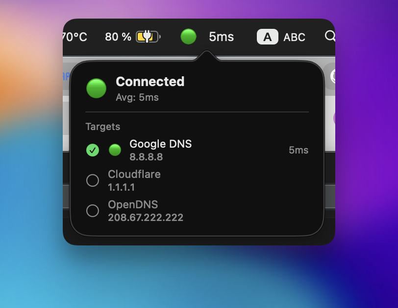
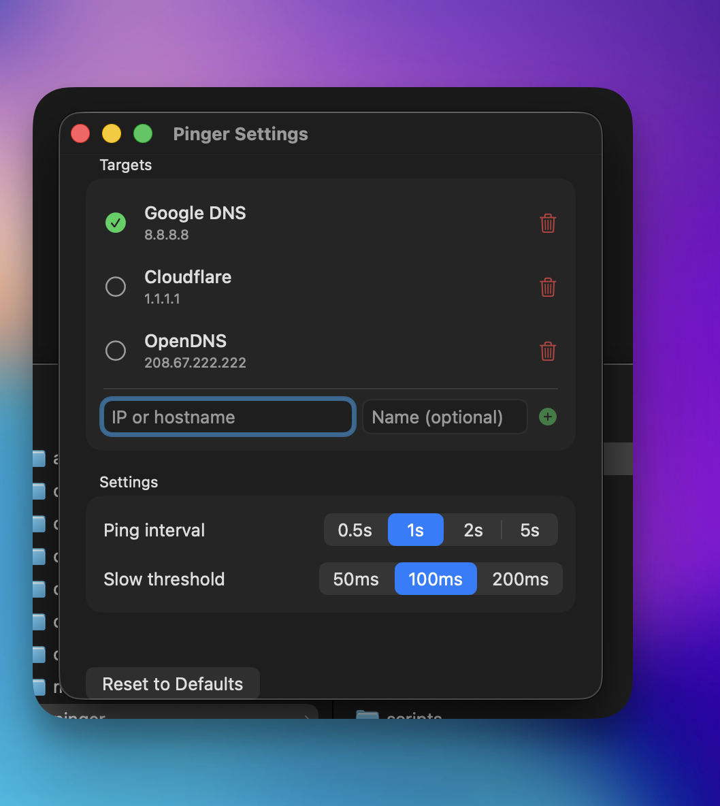

# Pinger

[](https://github.com/brilliant-almazov/pinger/actions/workflows/ci.yml)
[](https://codecov.io/gh/brilliant-almazov/pinger)

macOS menu bar utility for monitoring internet connection.

## Features

- Real-time ping monitoring in menu bar
- Multiple ping targets (Google DNS, Cloudflare, custom)
- Visual status indicators (🟢 🟡 🔴)
- Ping history
- Configurable interval and thresholds
- Pause/resume functionality

## Screenshots

<p align="center">
  
</p>

<p align="center">
  
  
</p>

## Requirements

- macOS 14.0+
- Xcode 16.0+

## Building

1. Install XcodeGen:
   ```bash
   brew install xcodegen
   ```

2. Generate Xcode project:
   ```bash
   xcodegen generate
   ```

3. Open and build:
   ```bash
   open Pinger.xcodeproj
   ```

## Development

Project uses XcodeGen for project configuration. Edit `project.yml` to modify project settings.

### Structure

```
Pinger/
├── Sources/
│   ├── App/        # App entry point, AppDelegate
│   ├── Models/     # Data models
│   ├── Services/   # Business logic
│   ├── Views/      # SwiftUI views
│   └── Utils/      # Utilities
├── Resources/      # Assets, Info.plist
PingerTests/        # Unit tests
PingerUITests/      # UI tests
```

## License

MIT
